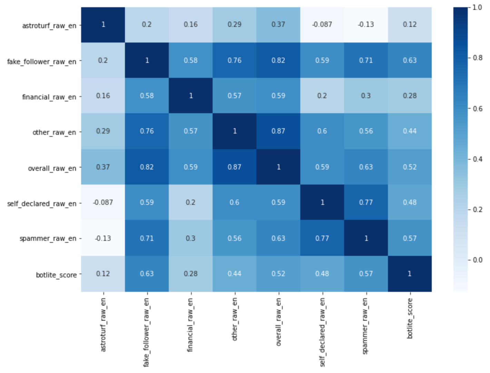

```{r setup, include=FALSE}
knitr::opts_chunk$set(
	echo = FALSE,
	message = FALSE,
	warning = FALSE
)
```

<style type="text/css">
.main-container {
  max-width: 1800px;
  margin-left: auto;
  margin-right: auto;
}
</style>

<div style="margin-left: 50px; margin-right:50px;">
**Abstract:** BotometerLite is advertised as a lightweight bot detector that improves scalability by focusing on only user profile information; furthermore, BotometerLite claims that using fewer features only entails a small compromise in individual accuracy. We test the validity of this claim by comparing Botometer with BotometerLite bot likelihood scores for 10,000 randomly sampled users. BotometerLite scores varied drastically from Botometer scores.   
</div> 

## Introduction

Botometer is one of the most popular bot detection tools used in social science @rauchfleisch2020false. Botometer was initially launched in May 2014 and BotometerLite was released in September 2020. The training and performance evaluation of BotometerLite is described in "Scalable and Generalizable Social Bot Detection through Data Selection" @yang2020scalable. 

@rauchfleisch2020false found Botometer scores are imprecise at estimating bots, especially in a different language, and prone to variance over time a high number of human users as bots and vice versa. 

In this study, we seek to answer the following questions: 

- **How similar are Botometer and BotometerLite ratings? **
- **Is BotometerLite effective at identifying specific types of bots (e.g., spammers, fake followers, etc.)?**
- **Can BotometerLite be used as an triage tool to identify a subset of accounts that require more extensive evaluation via Botometer?**

### Bot Type Scores

Bot scores describe how much an account acts like a specific kind of bot.
https://botometer.osome.iu.edu/faq

- **Astroturf:** manually labeled political bots and accounts involved in follow trains that systematically delete content
- **Fake follower:** bots purchased to increase follower counts
- **Financial:** bots that post using cashtags
- **Self declared:** bots from botwiki.org
- **Spammer:** accounts labeled as spambots from several datasets
- **Other:** miscellaneous other bots obtained from manual annotation, user feedback, etc.

**Complete Automation Probability** describes the probability, according to the Botometer model, that an account with this score or greater is at bot.

## Methodology

1. Randomly sample _n_ accounts from Twitter API.
2. Collect Botometer and BotometerLite bot likelihood scores.
3. Calculate correlation between scores.

## Results

### Raw English Scores

BotometerLite is most similar to the Botometer fake follower and spammer scores with $R^2$ values of 0.394 and 0.334, respectively.  Hence, if Botometer scores are accurate, BotometerLite may be somewhat effective at identifying some fake followers and spammers.

```{r, fig.width=14, fig.height=12}
library(tidyverse)
library(readxl)
library(ggplot2)

bot_full <- read_excel("botometer_full.xlsx")
bot_lite <- read_csv("botometer_scores_20Oct2020.csv") %>%
  select(id_str = user_id, bot_lite = botscore) %>% 
  mutate(id_str = id_str %>% as.character())

df <- left_join(bot_full, bot_lite, by = "id_str") %>%
  filter(!is.na(bot_lite), !is.na(overall_raw_en)) 
  
df <- bind_rows(
  df %>% select(id_str, screen_name, 
                bot_full = astroturf_raw_en, bot_lite) %>%
    mutate(type = "Astroturf"),
  df %>% select(id_str, screen_name, 
                bot_full = fake_follower_raw_en, bot_lite) %>%
    mutate(type = "Fake Follower"),
  df %>% select(id_str, screen_name, 
                bot_full = financial_raw_en, bot_lite) %>%
    mutate(type = "Financial"),
  df %>% select(id_str, screen_name, 
                bot_full = spammer_raw_en, bot_lite) %>%
    mutate(type = "Spammer"),
  df %>% select(id_str, screen_name, 
                bot_full = self_declared_raw_en, bot_lite) %>%
    mutate(type = "Self Declared"),
  df %>% select(id_str, screen_name,
                bot_full = other_raw_en, bot_lite) %>%
    mutate(type = "Other"),
  df %>% select(id_str, screen_name,
                bot_full = overall_raw_en, bot_lite) %>%
    mutate(type = "Overall"),
  df %>% select(id_str, screen_name,
                bot_full = cap_en, bot_lite) %>%
    mutate(type = "Complete Automation Probability"))       

lm_eqn = function(df){
    m = lm(bot_full ~ bot_lite, df);
    eq <- substitute(italic(r)^2~"="~r2, 
         list(r2 = format(summary(m)$r.squared, digits = 3)))
    as.character(as.expression(eq));                 
}        

require(plyr)
eq <- ddply(df,.(type),lm_eqn)

ggplot(data = df,
       mapping = aes(x = bot_lite,
                     y = bot_full)) +
  geom_point(size = 0.5, color = "blue", alpha = 0.5) +
   stat_smooth(method = "lm",color="red") +
  geom_label(data=eq,aes(x = 0.85, y = 0.9,label=V1), 
            parse = TRUE, inherit.aes=FALSE) +
  facet_wrap(~type, ncol = 3) +
  labs(title = "Botometer vs. BotometerLite Bot Likelihood Scores",
         x = "BotometerLite Score",
         y = "Botometer Score")
```

The pearson correlation matrix ($R^2$ values are the square of the values of this matrix) also shows the scores are weakly correlated.

<center>
#{width=600px}
</center>

### Raw Universal Scores

```{r, fig.width=14, fig.height=12}
df <- left_join(bot_full, bot_lite, by = "id_str") %>%
  filter(!is.na(bot_lite), !is.na(overall_raw_en)) 
  
df <- bind_rows(
  df %>% select(id_str, screen_name, 
                bot_full = astroturf_raw_un, bot_lite) %>%
    mutate(type = "Astroturf"),
  df %>% select(id_str, screen_name, 
                bot_full = fake_follower_raw_un, bot_lite) %>%
    mutate(type = "Fake Follower"),
  df %>% select(id_str, screen_name, 
                bot_full = financial_raw_un, bot_lite) %>%
    mutate(type = "Financial"),
  df %>% select(id_str, screen_name, 
                bot_full = spammer_raw_un, bot_lite) %>%
    mutate(type = "Spammer"),
  df %>% select(id_str, screen_name, 
                bot_full = self_declared_raw_un, bot_lite) %>%
    mutate(type = "Self Declared"),
  df %>% select(id_str, screen_name,
                bot_full = other_raw_un, bot_lite) %>%
    mutate(type = "Other"),
  df %>% select(id_str, screen_name,
                bot_full = overall_raw_un, bot_lite) %>%
    mutate(type = "Overall"),
  df %>% select(id_str, screen_name,
                bot_full = cap_un, bot_lite) %>%
    mutate(type = "Complete Automation Probability"))       

lm_eqn = function(df){
    m = lm(bot_full ~ bot_lite, df);
    eq <- substitute(italic(r)^2~"="~r2, 
         list(r2 = format(summary(m)$r.squared, digits = 3)))
    as.character(as.expression(eq));                 
}        

require(plyr)
eq <- ddply(df,.(type),lm_eqn)

ggplot(data = df,
       mapping = aes(x = bot_lite,
                     y = bot_full)) +
  geom_point(size = 0.5, color = "blue", alpha = 0.5) +
   stat_smooth(method = "lm",color="red") +
  geom_label(data=eq,aes(x = 0.85, y = 0.9,label=V1), 
            parse = TRUE, inherit.aes=FALSE) +
  facet_wrap(~type, ncol = 3) +
  labs(title = "Botometer vs. BotometerLite Bot Likelihood Scores",
         x = "BotometerLite Score",
         y = "Botometer Score")
```

## Conclusion

Future work for course project:

- Update introduction to include other articles that have critiqued Botometer
- Replicate results of Indiana University BotometerLite paper (Train a classifier to predict manually labeled bots and compare with BotometerLite)
- Post code to github repo

Questions:

- What statistical tests should we do to provide evidence Botometer and BotometerLite produce different results?  t-test for difference of means? F-test for difference of variance? Hotelling test across all bot scores?
- What visualizations should we use?  tSNE separating accounts with CAP > 0.8 from those with CAP < 0.8? 
- Is this study worth of pursuing for publication on Medium? or a peer-reviewed journal?


## References

---
nocite: '@*'
---
